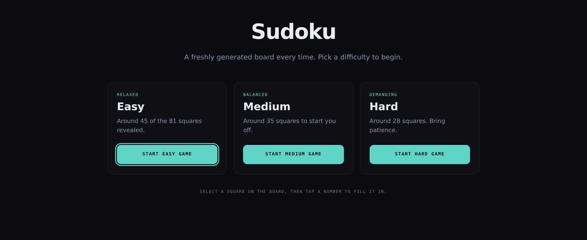
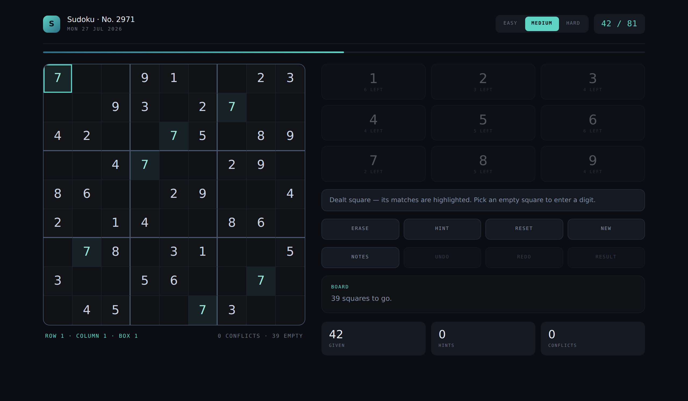
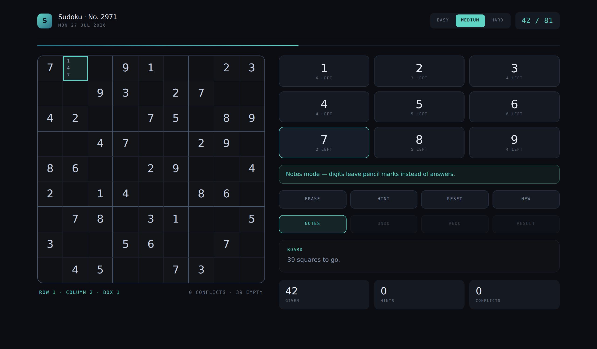
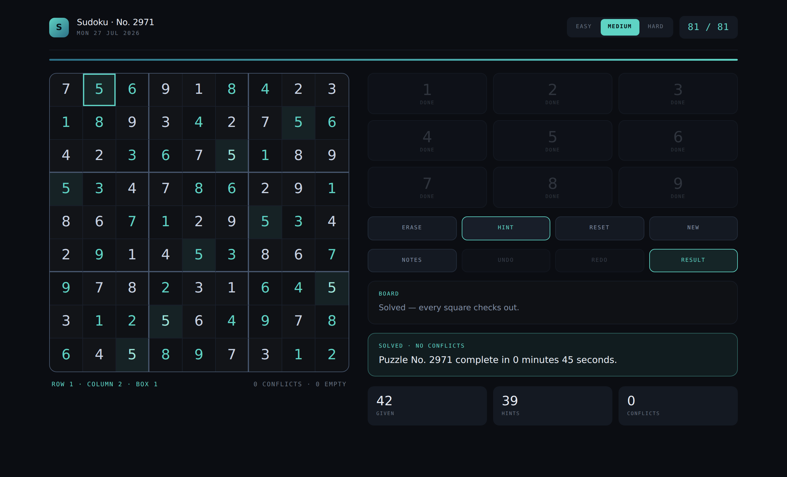
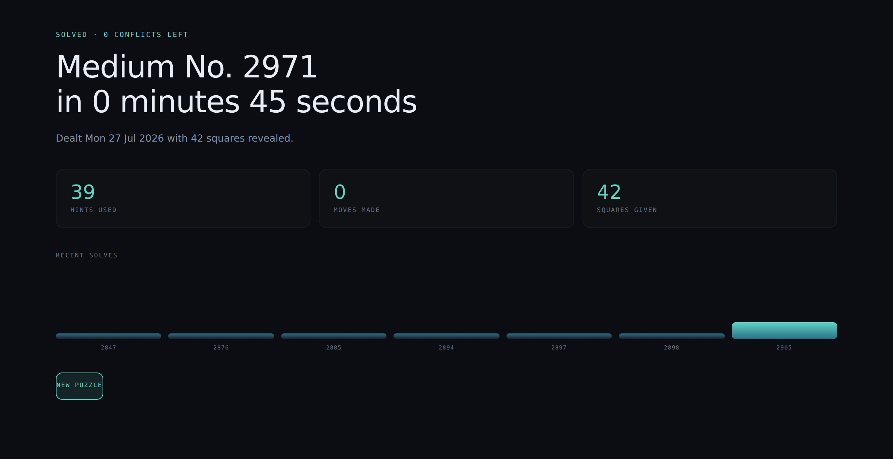

# mxcli-sudoku

A playable Sudoku app built in **Mendix 11.12.1**, authored entirely through
[`mxcli`](https://github.com/ako/mxcli) / MDL — no Studio Pro.

The toolchain that builds and runs it is set up by committed automation; see
[TOOLING.md](TOOLING.md).

## The app

| | |
|---|---|
| **Landing page** | `Sudoku.Home` — pick Easy / Medium / Hard |
| **Board** | `Sudoku.Game_Play` — 9x9 grid, number pad, notes, undo/redo |
| **Completion** | `Sudoku.Game_Done` — elapsed time, stats, recent solves |
| **Theme** | "Nocturne" — dark, mint accent, from a Claude design prototype |
| **Module** | `Sudoku` (the scaffolded `MyFirstModule` is left untouched) |



**Playing.** Choose a difficulty and a fresh board is dealt. Select a square,
then tap a digit on the number pad. Entries that disagree with the solution turn
red immediately and the conflict counter updates; dealt squares are read-only.
`Hint` reveals one square, `Reset` clears everything you filled in, and the board
flips to a solved banner once all 81 squares are correct.

`Notes` switches the pad to pencil marks: digits then leave candidates in a 3x3
grid inside the square instead of an answer, and writing an answer clears that
square's marks. `Undo` / `Redo` step through answer changes — pencil marks are
deliberately not reversible. `Result` opens the completion page.

Selecting a square that already holds a digit highlights every other square with
the same digit, which makes scanning for a number's placement much quicker.



In notes mode the pad writes pencil marks instead of answers, and the status
line says so:



A finished board turns the banner green, reads every key as DONE, and offers
the completion page:





### How boards are generated

`Sudoku.ACT_DealGame` produces boards that are valid, solvable, **and fully
determined** — exactly one solution.

1. **Build a complete grid** from the classic seed pattern

   ```
   base(r,c) = ((3*(r mod 3) + (r div 3) + c) mod 9) + 1
   ```

   then shuffle it with three transforms that preserve validity: rotate the rows
   inside each band, the columns inside each stack, and the digit alphabet —
   9 x 3^3 x 3^3 = 6,561 grids. Iterating band/row-in-band and stack/col-in-stack
   reads `r mod 3` and `r div 3` straight off the loop counters, so no integer
   division is needed (Mendix `div` returns a Decimal, tripping CE0117).

2. **Blank squares** in a strided pseudo-random order down to the difficulty's
   target. Any stride coprime with 81 walks every square exactly once.

3. **Repair until fully determined.** `Sudoku.ACT_SolveGrid` solves as far as
   logic allows using naked singles (one candidate left in a square) and hidden
   singles (a digit that fits only one square in a unit). Any square it cannot
   deduce is handed back as a given. Restoring every undetermined square at once
   massively over-restores, so the repair runs in four passes — returning a
   quarter, a third, a half, then the remainder — letting deductions cascade
   between passes. Because every blank that survives is recoverable by forced
   steps alone, the puzzle has **exactly one solution** by construction.

4. **Top up** if logic forced a sparser board than the tier wants. Revealing a
   square only adds information, so it never costs uniqueness.

The grid travels as an **81-character string** (`'0'` = empty), not as objects:
Mendix microflows have no arrays, and running the solver over 81 `Cell` rows
would put thousands of database operations in the middle of every deal. `Cell`
objects are created once, at the end, from the finished puzzle and solution.

Measured: a deal takes ~2-3s, and the ten most recent boards were each verified
straight out of PostgreSQL as a valid grid with exactly one solution.

**Difficulty ceiling.** The generator only emits puzzles solvable by singles, so
in Sudoku terms every board is gentle; Hard lands around 38-44 givens rather than
the mid-20s. Going lower needs a backtracking uniqueness checker, which is
impractical inside a microflow — that would be the job of a Java action.

### Domain model

```
Sudoku.Game  1 ──< Sudoku.Cell   (Cell_Game, delete cascades)
```

Each `Cell` stores the player's `Value` **and** its `SolutionValue`, so validating
a move is a direct comparison instead of a row/column/box scan. `CellClass` is
precomputed at deal time and carries the 3x3 box borders plus the given/open
state, keeping the page free of large inline expressions.

### Why a number pad instead of typing

Every move is a normal server-side microflow (`ACT_ApplyValue`) that commits the
cell and re-evaluates the board. Text inputs would leave edits sitting in
client-side state that a later microflow wouldn't see. A Mendix button can only
map object parameters — not literals — so each digit gets a thin wrapper
(`ACT_Set1`…`ACT_Set9`) delegating to the single copy of the move logic.

### Chrome and controls

The board page follows the developed "Nocturne" frames of the design handoff:

- **Header** — logo mark, puzzle number (`PuzzleNo`, an autonumber starting at
  2831), the deal date preformatted as `SAT 25 JUL 2026`, an EASY/MEDIUM/HARD
  switch that highlights the current tier, and a filled/81 counter.
- **Progress bar** — a widget cannot take a dynamic inline width, so
  `ACT_Refresh` publishes a 0..20 `ProgressBucket` and one CSS class per 5%
  sets the width.
- **Number pad** — keys are CONTAINERs with `OnClick`, not ACTIONBUTTONs,
  because a button cannot hold the two stacked labels the design uses (digit
  over "4 LEFT"). A digit placed nine times dims and reads DONE.
- **Status line** — `ROW r · COLUMN c · BOX b` for the selected square, plus
  conflicts and empty counts.
- **Locked pad** — selecting a dealt square dims the pad and says so, rather
  than letting `ACT_ApplyValue` discard the digit silently.
- **Same-digit highlight** — selecting a filled square lights up every square
  holding that digit (`Cell.IsPeer`, recomputed by `ACT_MarkPeers` on selection
  and after every move). Declared *before* `.sd-bad` and `.sd-sel` in the theme,
  since equal specificity means source order decides: a conflict must stay red
  and the selected square must keep its ring even when both also match.
- **Notes** — nine `N1`..`N9` booleans per cell, not one packed string: a widget
  cannot index into a string, and each mark needs its own visibility expression.
  Each mark is pinned to its slot with `grid-area`, or hidden marks would
  collapse the grid and pack the visible ones top-left.
- **Undo / redo** — a `Move` log with a cursor (`MoveSeq` / `MaxSeq`). Making a
  move after undoing drops the redo tail, as in any editor. Only answers are
  logged; the tools disable themselves via `CanUndo` / `CanRedo`.
- **Completion page** — kicker, headline with elapsed time, three stat tiles and
  a recent-solves strip. The strip reuses the progress-bar trick: a 0..20
  `BarBucket` (one step per 15s) plus one CSS class per 5% of height.

The **Game owns the selection** through `Game_SelectedCell`. That is what lets
the pad live in the Game's data context (so it can show per-digit remainders)
while its keys still act on the selected square, and it replaces the gallery's
own selection with a `Cell.IsSelected` flag the theme can style.

### Styling

Atlas-first, per the four-layer model:

- **Layer 1** — `theme/web/custom-variables.scss`: `--brand-primary` retuned to
  the Nocturne mint `#5FD3C4`.
- **Layer 2** — `theme/web/_sudoku.scss`: the palette (`#0B0D12` ground,
  `#0F1115` panels, `#5FD3C4` accent, `#FF6B6B` conflicts), the rule grid,
  digit treatment, pad, chrome and cards.
- The app **commits to a single dark theme** rather than a
  `prefers-color-scheme` flip: Atlas's own widgets ship light-only surfaces and
  a half-dark result reads worse than a consistent one. That is affordable here
  because the board uses no Atlas input widgets — every control is a container
  or a button. The Atlas topbar and sidebar are hidden on Sudoku pages, since
  the design carries its own chrome.
- Webfonts (Space Grotesk, JetBrains Mono) are `@import`ed on the **first line**
  of `main.scss`; a CSS `@import` emitted after any rule is silently dropped.

## Source layout

MDL source lives in `Sudoku/mdlsource/` and is applied in order:

| Script | Contents |
|---|---|
| `01-domain-model.mdl` | Module, enumerations, `Game` + `Cell`, association |
| `02-domain-refinements.mdl` | Selection, per-digit remainders, progress, date label |
| `03-microflows-engine.mdl` | `ACT_Refresh`, logic solver, generator, hint, reset |
| `04-microflows-moves.mdl` | Select, apply, clear, nine pad wrappers |
| `04a-nanoflows.mdl` | Client-side moves — runs in the browser |
| `05-page-done.mdl` | The completion page (no outgoing references) |
| `06-page-play.mdl` | The board page (Nocturne) |
| `07-home.mdl` | New-game actions, landing page, back-links |
| `08-navigation.mdl` | Responsive profile → `Sudoku.Home` |

`04a` is a nanoflow — it runs in the browser, not on the server. The Notes
switch flips one boolean, and doing that through a microflow cost two `/xas/`
round trips and ~37 KB (the gallery refetching all 81 squares, because the Game
was committed with `refresh`). As a nanoflow it is **0 round trips, 0 bytes**.
It deliberately does not commit: Mendix carries an object's uncommitted client
state into the next microflow that takes it as a parameter, so `ACT_ApplyValue`
still sees the mode the player picked.

The numbering **is** the dependency order — each script only references what
earlier ones created, so a fresh project applies them 01→08 with no forward
references. Both reference cycles (`Home` → `ACT_New*` → `Game_Play` → `Home`,
and `Game_Done` → `Home`) are broken by ALTERs at the end of `07`, which is why
neither page may reference `Sudoku.Home` at creation time, and why the completion
page is built *before* the board page that links to it.

`01` and `02` are create/add-only: re-running them against a built project stops
at the first "already exists", so apply deltas separately. `03`-`08` are
`create or replace` and safely repeatable.

Re-apply any of them (each is `create or replace`):

```bash
cd Sudoku
./mxcli check mdlsource/03-microflows-engine.mdl -p Sudoku.mpr --references
./mxcli exec  mdlsource/03-microflows-engine.mdl -p Sudoku.mpr
```

After a page-structure change, restart `mxcli run` rather than trusting the
incremental reload — see [FINDINGS.md](FINDINGS.md) #14.

## Running it

`scripts/run-app.sh` starts the app automatically at session start; to run it by
hand:

```bash
mxcli run --local --ensure-db --watch -p "$PWD/Sudoku/Sudoku.mpr"
```

The app serves at <http://127.0.0.1:8080/>. Set `MXCLI_HUB_SECRET` (and
optionally `MXCLI_HUB_URL`) in the environment to also register it with an
`mxcli tunnel-hub` for a public preview URL.

### Watching what the UI triggers

Every action microflow logs its own name to the log node `Sudoku`, so playing
the app prints the call chain:

```bash
scripts/trace.sh          # follow live  (--all for the history so far)
```

```
07:12:03  ACT_Set1
07:12:03  ACT_ApplyValue digit=1
07:12:03  ACT_LogMove
07:12:03  ACT_Refresh
07:12:03  ACT_MarkPeers
22:52:27  NF_ToggleNotes
```

Nanoflow lines arrive too, but the runtime rewrites their log node to
`Client_Nanoflow` rather than the one the script declares, so the filter has to
match both — see [FINDINGS.md](FINDINGS.md) #28.

The lines come from `Sudoku/.mxcli/runtime.log`, which `mxcli run --local` fills
with the Mendix application log — see [FINDINGS.md](FINDINGS.md) #25 for how that
plumbing came to exist.

### Metrics and traces

The runtime carries Micrometer and the OpenTelemetry Java agent. Both are
opt-in flags on `mxcli run`:

```bash
mxcli run --local --watch --metrics --trace -p "$PWD/Sudoku/Sudoku.mpr"
```

`--metrics` registers a Prometheus registry and serves it at
`http://127.0.0.1:8090/prometheus` — 71 families, including the `connectionbus`
counters that make DB churn per interaction measurable. `--trace` attaches the
bundled agent and, importantly, applies default span filters: unfiltered
per-activity tracing turns one board deal into ~110,000 spans and 5.8s instead
of 433 spans and 0.9s. Your own `OTEL_*` environment wins over the defaults, so
exporting to a real collector instead of the console still works.

### Flame charts

The console exporter prints span names but no timings or parents, so it cannot
make a flame chart. Point the agent at the bundled OTLP collector instead:

```bash
scripts/otlp-collect.py --out spans.jsonl &            # :4318, no dependencies
OTEL_TRACES_EXPORTER=otlp OTEL_EXPORTER_OTLP_PROTOCOL=http/protobuf \
OTEL_EXPORTER_OTLP_ENDPOINT=http://127.0.0.1:4318 \
  mxcli run --local --watch --trace -p "$PWD/Sudoku/Sudoku.mpr"

scripts/flame.py spans.jsonl --list                    # what was captured
scripts/flame.py spans.jsonl --flow ACT_SelectCell --html chart.html
```

`flame.py` prints an ASCII flame chart — nesting, duration, share of the root,
sub-microflows, activities and database queries — and `--html` writes a
self-contained visual one.

**Across apps.** Trace context propagates over REST/OData in both directions
with no extra configuration — a `rest call` injects W3C `traceparent`, and an
incoming one is adopted rather than starting a fresh trace. Point every app at
the same collector and give each a distinct service name:

```bash
mxcli run --local --trace --trace-service AppB --app-port 8081 \
  --admin-port 8091 --serve-port 6544 --db-name appb -p AppB/AppB.mpr
```

`flame.py` then prefixes each row with the app it came from:

```
[Sudoku]  Microflow Sudoku.ACT_Hint        13.38ms   63.1%
  [Sudoku]  CallRest activity              12.56ms   59.3%
    [Sudoku]  GET                           8.39ms   39.6%
      [SudokuB]  GET /*                     4.08ms   19.2%
```

Per-app console exporters cannot be correlated — one collector is required.

**Read the numbers with care.** Unfiltered per-activity tracing distorts what it
measures: the same deal profiles at 358ms with the default span filters and
3,774ms without, and a `SELECT` that really takes 4ms appears as 2,026ms. Use
the filters for timing, and turn them off only to inspect the *shape* of a small
flow.

### Querying it all together

Model metadata, app data, traces, metrics and logs otherwise need four different
query languages. DuckDB reads all of them in place — **development only**, as a
separate process, nothing added to mxcli:

```bash
pip install duckdb
mxcli -p Sudoku/Sudoku.mpr -c "REFRESH CATALOG FULL"   # fills activities + refs
scripts/warehouse.py build            # create the views
scripts/warehouse.py hot-microflows   # runtime cost x model complexity
scripts/warehouse.py hot-tables       # query time x entity x live row counts
scripts/warehouse.py sql "SELECT …"   # anything else
```

`.mxcli/catalog.db` (SQLite, 70 tables) and the app's PostgreSQL are both
`ATTACH`ed read-only as `cat.*` and `pg.*`; traces, metrics and logs are JSON
views. Plain `REFRESH CATALOG` leaves `activities_data` and `refs` empty — use
`FULL`.

The point is the joins. `hot-microflows` shows that `ACT_Set1` — two activities,
McCabe 1 — costs five times `ACT_MarkPeers` at fourteen activities, which no
lint rule can see. `hot-tables` shows the task-queue poller is the largest
database consumer in the app and belongs to no microflow at all.

Logs are the one source that will not join cleanly: runtime log lines carry no
trace id, so logs-to-traces is a timestamp join. See [FINDINGS.md](FINDINGS.md) #30.

`scripts/otel.sh` reads the results back: `metrics` (the Mendix counters,
aggregated), `spans` (volume by name), `trace` (one request as a tree). Details
in [FINDINGS.md](FINDINGS.md) #29.

### Breakpoints

The runtime also carries a real debugger. `scripts/mfdebug.sh` drives it:

```bash
scripts/mfdebug.sh enable
scripts/mfdebug.sh session
scripts/mfdebug.sh activities Sudoku.ACT_Hint     # ids you can break on
scripts/mfdebug.sh break Sudoku.ACT_Hint <object-id>
scripts/mfdebug.sh paused                         # variables in scope
scripts/mfdebug.sh object <debug-id> Game
scripts/mfdebug.sh step over <debug-id>
scripts/mfdebug.sh continue
scripts/mfdebug.sh disable
```

Nanoflows break through the same endpoint — `nactivities` and `nbreak` — but a
paused nanoflow never shows up under `paused`; it arrives as an event, so use
`events` instead. And a nanoflow's `debug_id` is single-use — each step mints a
new one, unlike a microflow's — so re-read `events` between steps.

A breakpoint pauses **whoever** hits it, browser included, and their request
hangs until `continue`. Always finish with `disable`. The protocol it speaks is
written up in [FINDINGS.md](FINDINGS.md) #26.

## Verification

`mx check` reports **0 errors**. Beyond that the app was driven with Playwright:
a board was dealt, a square selected, digits entered, erased and reset, and a
game played to completion (solved banner, 0 conflicts, no JS errors). The
generator was checked independently by reading every dealt board out of
PostgreSQL and asserting each row, column and 3x3 box contains 1-9 exactly once.

The Nocturne pass was verified the same way: a dealt board renders 81 squares,
9 keys and 4 tools with the Atlas shell hidden; selecting a square updates the
status line and the mint ring; placing a digit decrements that key's remaining
count and advances the progress bucket; selecting a dealt square locks the pad
and leaves the board unchanged; and a full solve reaches the win banner with all
nine keys reading DONE and no JS errors.

Known cosmetic lint findings, all informational: `MPR008` (MDL auto-positions
overlap on the Studio Pro canvas inside `ACT_DealGame`'s nested loops) and
`SEC001` (no entity access rules — project security level is `Off`, the Mendix
default for a prototype).

The notes/undo/completion pass was verified the same way: pencil marks land in
the selected square without touching answers, writing an answer clears them,
undo/redo step a move back and forward, and a solve reaches the completion page
with the elapsed time and the recent-solves strip — no JS errors.

Every mxcli bug, gap and limitation hit while building this is written up in
[FINDINGS.md](FINDINGS.md), which also records a verification pass against
`main` + open PRs #26-#29: seven findings fixed, one partially, two withdrawn as
my own misdiagnosis, and one new data-loss hazard found (#24). Including the two
build notes below: a **page-structure
change can leave the client bundle unbuilt**, which shows up as a 404 on
`/dist/pages/<Page>.js` and a board that never renders — restart
`mxcli run` to force a full re-bundle. And running `mxbuild` by hand while
`mxcli run --watch` is live makes both fight over `deployment/`, wedging the
watch loop; restart it rather than debugging the model.
